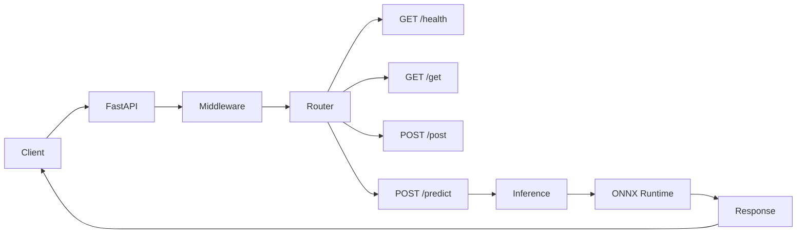
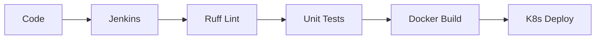

# API Project

FastAPI API service with ONNX (random forest) inference, Jenkins CI/CD, Kubernetes deployment, structured logging, and Prometheus/Grafana observability.

## Quick start

Create a virtual environment, install dependencies, **download the random forest ONNX model**, then run the API:

```bash
make venv
source .venv/bin/activate   # On Windows: .venv\Scripts\activate
make install
make download-model         # Downloads or generates models/random_forest.onnx
make run
```

The API is available at `http://localhost:8000`. Interactive docs: `http://localhost:8000/docs`.

**Example requests:** See [assets/examples/](assets/examples/) for ready-to-run `curl` commands and shell scripts (health, get, post, predict, metrics).

**First-time setup:** `make download-model` creates `models/random_forest.onnx`. It tries to download from `MODEL_URL` (env) if set; otherwise it runs `scripts/export_onnx.py` (requires scikit-learn and skl2onnx from dev deps).

## Architecture



## CI/CD pipeline



## API endpoints

| Method | Path     | Description |
|--------|----------|-------------|
| GET    | `/health` | Health status (liveness/readiness). Returns `{"status": "healthy", "service": "api"}`. |
| GET    | `/get`   | Example GET: JSON with 200 (e.g. `{"message": "Hello", "ok": true}`). |
| POST   | `/post`  | Echo request body and add `timestamp` (ISO UTC). Accepts any valid JSON. |
| POST   | `/predict` | Run random forest ONNX model. Body: `{"features": [float, ...]}` with 4 features. |
| GET    | `/metrics` | Prometheus metrics (scrape target). |

**curl examples:** Copy-paste from [assets/examples/README.md](assets/examples/README.md), or run the scripts in `assets/examples/*.sh` (e.g. `./assets/examples/health.sh`) with the API running.

### Random forest model (`/predict`)

- **Input:** JSON body with key `features`: array of 4 floats (e.g. `{"features": [0.1, -0.2, 0.3, 0.4]}`).
- **Output:** Prediction (class probabilities or label depending on model).
- Model file: `models/random_forest.onnx` (generated by `scripts/export_onnx.py`). Override with env `ONNX_MODEL_PATH`.

## Project layout

```text
apiproject/
├── .venv/                  # Python venv (create via make venv)
├── app/
│   ├── __init__.py
│   ├── main.py             # FastAPI app, routes; imports middleware
│   ├── middleware.py       # Custom middleware (request ID, logging)
│   ├── inference.py        # ONNX load + predict (random forest)
│   ├── logging_config.py   # Structlog configuration
│   └── metrics.py          # Prometheus metrics
├── models/
│   └── random_forest.onnx  # Pre-existing random forest ONNX
├── assets/
│   └── examples/           # curl examples and shell scripts
├── scripts/
│   └── export_onnx.py      # One-time export of RF model to ONNX
├── tests/
├── k8s/                    # Kubernetes manifests
├── deploy/                 # Prometheus/Grafana config
├── pyproject.toml
├── Makefile
├── Dockerfile
├── Jenkinsfile
└── README.md
```

## Development

### Lint and format

```bash
make lint    # Ruff check + format check
make format  # Ruff format + fix
```

### Tests

```bash
make test    # Pytest with coverage (fail under 70%)
```

### Run locally

```bash
make run     # Uvicorn on http://0.0.0.0:8000
```

### Logging

- **LOG_LEVEL:** `DEBUG`, `INFO`, `WARNING`, `ERROR` (default: `INFO`).
- **LOG_FORMAT:** `console` (default) or `json`.

Example: `LOG_LEVEL=DEBUG LOG_FORMAT=json make run`

## Docker

```bash
make docker-build
make docker-run
```

Then open `http://localhost:8000/health`.

## Kubernetes

Ensure the image is available to your cluster (e.g. load into kind/minikube or use a registry). Then:

```bash
make k8s-apply
kubectl port-forward svc/apiproject 8000:8000
```

Hit `http://localhost:8000/health`, `http://localhost:8000/get`, etc.

## Benchmarking

Use [ghz](https://github.com/bojand/ghz) for load testing (e.g. 50+ TPS):

```bash
# GET /health
ghz --insecure --connections=10 --duration=30s --rps=50 http://localhost:8000/health

# POST /post (example)
ghz --insecure -m POST -d '{"key":"value"}' -c 'application/json' --connections=10 --rps=50 --duration=30s http://localhost:8000/post
```

See `docs/benchmark.md` for more scenarios and sample results.

## Observability (Prometheus & Grafana)

- **Metrics:** Scrape `http://localhost:8000/metrics`. Metrics include `http_requests_total`, `http_request_duration_seconds`, and (for `/predict`) `predictions_total`, `inference_duration_seconds`.
- **Prometheus:** Put `deploy/prometheus.yml` in your Prometheus config; add a scrape job for this API.
- **Grafana:** Add Prometheus as a data source; build dashboards for request rate, latency percentiles, and error rate.

See `deploy/` for example configs and the "Observability" section in this README when those files are added.
